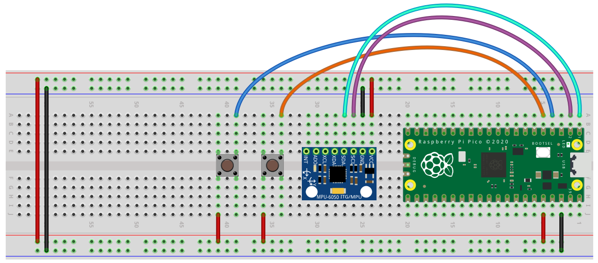

# Raspberry Pi Pico Bird Shooter

# Pełny program – kolejne zajęcia

# Program testowy – plan na dzisiaj

# Założenia projektu

Gra polegająca na zestrzeliwaniu przelatujących ptaków\.

Przez dwie kolejne lekcje będziemy tworzyć grę sterowaną poprzez żyroskop podłączony do Raspberry Pi Pico\.

Żyroskop będzie wykorzystany do ustawienia celownika na ekranie\, który pozwoli nam na zestrzelenie przelatujących ptaków\.

Potrzebny układ elektroniczny nie jest skomplikowany\, ale będziemy musieli zbudować go ponownie na następnych zajęciach\.

# Schemat projektu

# Pico

Dokładamy kolejny przycisk\, którego wartości wypisujemy w porcie szeregowym\.

Ten przycisk posłuży nam jako spust do wykorzystania w grze\.

# PC - Biblioteki do podpięcia

# PC funkcja cz. 1

Pobieramy dane z Pico i wykorzystujemy je do obliczenie pozycji wskaźnika\.

Dodatkowo możemy wyświetlić dane w konsoli\, żeby sprawdzić ich poprawność\.

Dla ciekawskich można sprawdzić co oznaczają nazwyroll\,pitchiyaw\.

Dalsza część funkcji rysującej wskaźnik

Dbamy o to\, żeby wskaźnik nie wyszedł poza okno\.

Dodatkowo wprowadzamy warunek\, który czyści port szeregowy czas co jakiś czas\. Jak się okazuje\, zbyt duża nieodczytanych danych może spowodować spowolnione działanie\.

# PC pętla główna

Inicjujemy połączenie z Pico oraz tworzymy odpowiednie zmienne\.

Opcja __DOUBLEBUF__ pozwoli na szybsze działanie programu\.

# Koniec!

